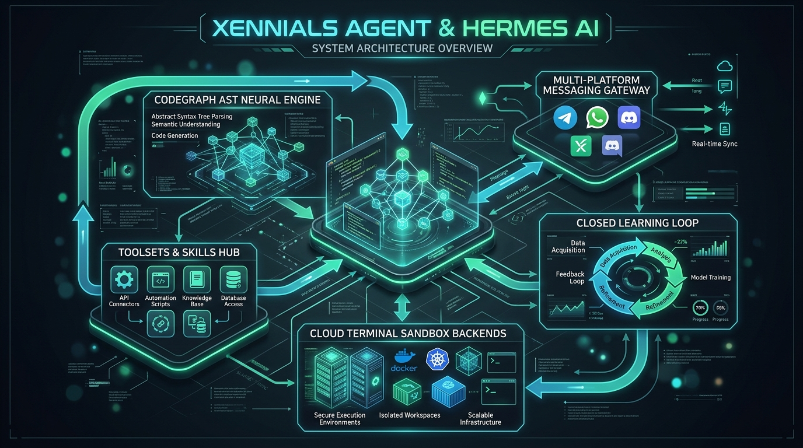

# Xennials Agent & Hermes AI — System Architecture & Infographic

<p align="center">
  
</p>

---

## 🌌 Architectural Overview

**Xennials Agent** is an autonomous, self-improving AI development platform powered by the **Hermes AI Engine** and **CodeGraph AST Neural Graph**. It combines an agentic closed learning loop, multi-platform messaging, containerized execution sandboxes, and extensible MCP toolsets into a single unified operating system.

---

## 🧩 Core Architectural Subsystems

```mermaid
flowchart TD
    subgraph Multi-Platform Ingress
        TG[Telegram Bot]
        WA[WhatsApp Web Bridge]
        DC[Discord Gateway]
        SL[Slack App]
        CLI[Interactive TUI / CLI]
    end

    subgraph Core Agentic Kernel
        GW[Hermes Gateway Router]
        ENGINE[Hermes Cognitive Engine]
        MEM[Honcho Memory & FTS5 Recall]
        LOOP[Closed Learning Loop & Skill Generator]
    end

    subgraph Knowledge & AST Optimization
        CG[CodeGraph AST Engine\n-57% Token Burn / 7,935 Files Indexed]
        MCP[MCP Tool Registry\nCodeGraph + Higgsfield + Firecrawl + Browser Use]
    end

    subgraph Cloud Sandbox Backends
        LOCAL[Local Host]
        DOCKER[Docker / Docker-in-Docker]
        MODAL[Modal Serverless Sandbox]
        DAYTONA[Daytona Persistent MicroVM]
        CODESPACES[GitHub Codespaces Multi-IDE]
    end

    Multi-Platform Ingress <--> GW
    GW <--> ENGINE
    ENGINE <--> MEM
    ENGINE <--> LOOP
    ENGINE <--> CG
    ENGINE <--> MCP
    ENGINE <--> Cloud Sandbox Backends
```

---

## ⚡ Key Subsystem Deep-Dive

### 1. 🔄 The Closed Learning Loop
- **Autonomous Skill Extraction**: Creates procedural skill manifests (`SKILL.md`) in real time following successful multi-step task execution.
- **Continuous Skill Refinement**: Analyzes runtime errors, patches code tools, and improves performance with each iteration.
- **Dialectic User Modeling**: Deepens user preferences, coding habits, and project architectural styles via [Honcho](https://github.com/plastic-labs/honcho) and SQLite FTS5 session search.

### 2. ⚡ CodeGraph AST Neural Engine
- **Pre-Indexed Symbol Graph**: Eliminates trial-and-error recursive file searches, reducing token burn by **57%** and task latency by **46%**.
- **Bidirectional Dynamic Dispatch**: Resolves cross-file references, type definitions, and call hierarchies directly through native MCP tools.

### 3. 🌐 Multi-Platform Messaging Gateway
- **Single Process Topology**: One unified gateway process manages simultaneous bidirectional communication across **Telegram**, **WhatsApp**, **Discord**, **Slack**, **Signal**, and **Email**.
- **Voice-to-Task Transcription**: Supports voice memo processing, audio speech response (Google Gemini / OpenAI TTS), and session handoffs.

### 4. 🛠️ Extensible Toolsets & MCP Integration
- **Higgsfield AI Engine**: Studio-grade text-to-image, video generation, and product photorealism workflows.
- **Firecrawl & Browser Use**: Live web scraping, deep research, and automated headless browser orchestration.
- **Multi-Model Fallback Routing**: Auto-fails over across NVIDIA NIM, ModelScope, Google Gemini, and OpenRouter without task interruption.

### 5. ☁️ Universal Terminal Sandbox Backends
- **Isolation by Choice**: Seamlessly switch between Local, Docker-in-Docker, Modal, Daytona, and GitHub Codespaces devcontainers.

---

<p align="center">
  <b>Built with ❤️ by Nous Research & Xennials Dev</b>
</p>
