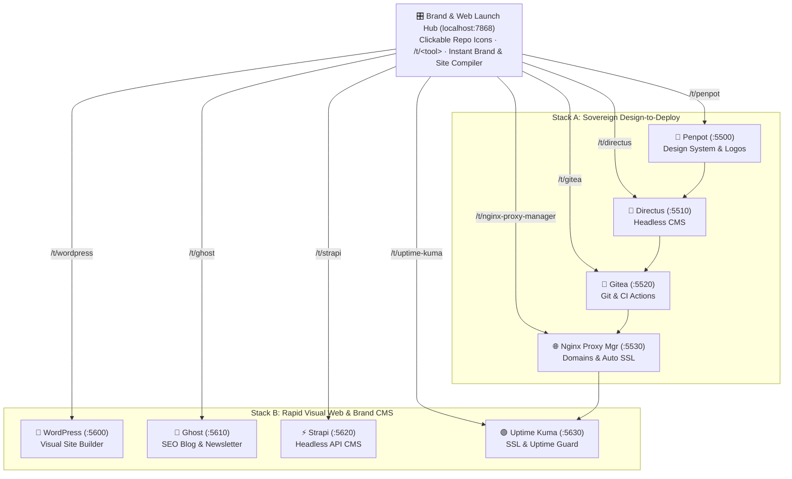

# Production System Architecture — Brand & Web Launch

**Service ID:** `TS101-SRV-04`  
**Control Plane Hub:** `http://localhost:7868` (`hub/app.py`)

```mermaid
flowchart TD
    Hub["🎛️ Brand & Web Launch Hub (localhost:7868)<br/>Clickable Repo Icons · /t/&lt;tool&gt; · Instant Brand & Site Compiler"]

    subgraph StackA["Stack A: Sovereign Design-to-Deploy"]
        Penpot["🎨 Penpot (:5500)<br/>Design System & Logos"]
        Directus["🧱 Directus (:5510)<br/>Headless CMS"]
        Gitea["🦊 Gitea (:5520)<br/>Git & CI Actions"]
        NPM["🌐 Nginx Proxy Mgr (:5530)<br/>Domains & Auto SSL"]
    end

    subgraph StackB["Stack B: Rapid Visual Web & Brand CMS"]
        WP["📝 WordPress (:5600)<br/>Visual Site Builder"]
        Ghost["👻 Ghost (:5610)<br/>SEO Blog & Newsletter"]
        Strapi["⚡ Strapi (:5620)<br/>Headless API CMS"]
        Kuma["🟢 Uptime Kuma (:5630)<br/>SSL & Uptime Guard"]
    end

    Hub -->|/t/penpot| Penpot
    Hub -->|/t/directus| Directus
    Hub -->|/t/gitea| Gitea
    Hub -->|/t/nginx-proxy-manager| NPM
    Hub -->|/t/wordpress| WP
    Hub -->|/t/ghost| Ghost
    Hub -->|/t/strapi| Strapi
    Hub -->|/t/uptime-kuma| Kuma

    Penpot --> Directus --> Gitea --> NPM --> Kuma
```
