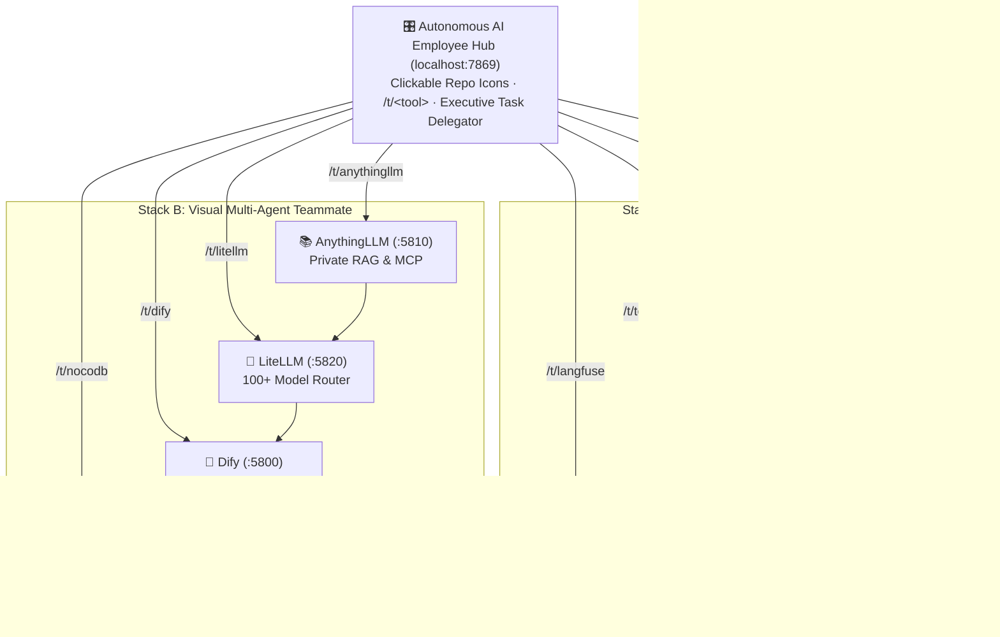

# Production System Architecture — Autonomous AI Employee

**Service ID:** `TS101-SRV-05`  
**Control Plane Hub:** `http://localhost:7869` (`hub/app.py`)

```mermaid
flowchart TD
    Hub["🎛️ Autonomous AI Employee Hub (localhost:7869)<br/>Clickable Repo Icons · /t/&lt;tool&gt; · Executive Task Delegator"]

    subgraph StackA["Stack A: Sovereign Executive Orchestrator"]
        WebUI["🧠 Open WebUI (:5700)<br/>Executive Command UI"]
        Qdrant["🧬 Qdrant (:5710)<br/>Vector Memory"]
        Temporal["⏱️ Temporal (:5720)<br/>Durable Task Engine"]
        Langfuse["🔍 Langfuse (:5730)<br/>Audit & Cost Traces"]
    end

    subgraph StackB["Stack B: Visual Multi-Agent Teammate"]
        Dify["🤖 Dify (:5800)<br/>Visual Agent Studio"]
        AnyLLM["📚 AnythingLLM (:5810)<br/>Private RAG & MCP"]
        LiteLLM["🚦 LiteLLM (:5820)<br/>100+ Model Router"]
        NocoDB["📋 NocoDB (:5830)<br/>Approval Task Board"]
    end

    Hub -->|/t/open-webui| WebUI
    Hub -->|/t/qdrant| Qdrant
    Hub -->|/t/temporal| Temporal
    Hub -->|/t/langfuse| Langfuse
    Hub -->|/t/dify| Dify
    Hub -->|/t/anythingllm| AnyLLM
    Hub -->|/t/litellm| LiteLLM
    Hub -->|/t/nocodb| NocoDB

    WebUI --> Qdrant --> Temporal --> Langfuse
    AnyLLM --> LiteLLM --> Dify --> NocoDB
```
