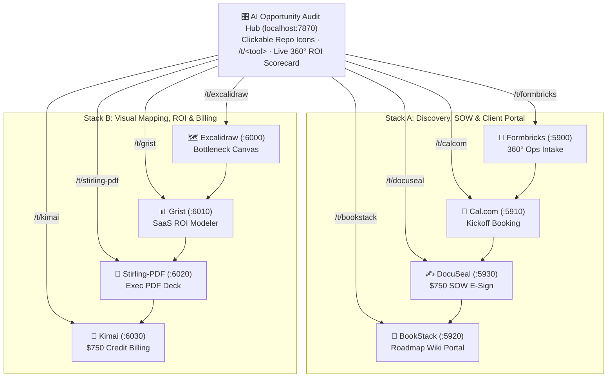

# Production System Architecture — AI Opportunity Audit ($750)

**Service ID:** `TS101-SRV-06`  
**Control Plane Hub:** `http://localhost:7870` (`hub/app.py`)

```mermaid
flowchart TD
    Hub["🎛️ AI Opportunity Audit Hub (localhost:7870)<br/>Clickable Repo Icons · /t/&lt;tool&gt; · Live 360° ROI Scorecard"]

    subgraph StackA["Stack A: Discovery, SOW & Client Portal"]
        FB["📝 Formbricks (:5900)<br/>360° Ops Intake"]
        Cal["📅 Cal.com (:5910)<br/>Kickoff Booking"]
        Book["📘 BookStack (:5920)<br/>Roadmap Wiki Portal"]
        Seal["✍️ DocuSeal (:5930)<br/>$750 SOW E-Sign"]
    end

    subgraph StackB["Stack B: Visual Mapping, ROI & Billing"]
        Excal["🗺️ Excalidraw (:6000)<br/>Bottleneck Canvas"]
        Grist["📊 Grist (:6010)<br/>SaaS ROI Modeler"]
        PDF["📄 Stirling-PDF (:6020)<br/>Exec PDF Deck"]
        Kimai["🧾 Kimai (:6030)<br/>$750 Credit Billing"]
    end

    Hub -->|/t/formbricks| FB
    Hub -->|/t/calcom| Cal
    Hub -->|/t/bookstack| Book
    Hub -->|/t/docuseal| Seal
    Hub -->|/t/excalidraw| Excal
    Hub -->|/t/grist| Grist
    Hub -->|/t/stirling-pdf| PDF
    Hub -->|/t/kimai| Kimai

    FB --> Cal --> Seal --> Book
    Excal --> Grist --> PDF --> Kimai
```
