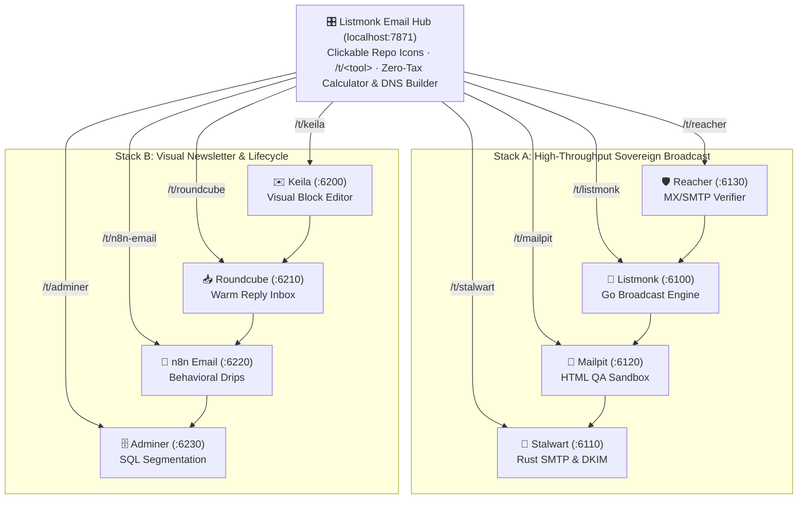

# Production System Architecture — Listmonk Email Marketing

**Service ID:** `TS101-SRV-07`  
**Control Plane Hub:** `http://localhost:7871` (`hub/app.py`)

```mermaid
flowchart TD
    Hub["🎛️ Listmonk Email Hub (localhost:7871)<br/>Clickable Repo Icons · /t/&lt;tool&gt; · Zero-Tax Calculator &amp; DNS Builder"]

    subgraph StackA["Stack A: High-Throughput Sovereign Broadcast"]
        LM["📧 Listmonk (:6100)<br/>Go Broadcast Engine"]
        Stal["📮 Stalwart (:6110)<br/>Rust SMTP &amp; DKIM"]
        MP["🧪 Mailpit (:6120)<br/>HTML QA Sandbox"]
        Reach["🛡️ Reacher (:6130)<br/>MX/SMTP Verifier"]
    end

    subgraph StackB["Stack B: Visual Newsletter & Lifecycle"]
        Keila["✉️ Keila (:6200)<br/>Visual Block Editor"]
        RC["📥 Roundcube (:6210)<br/>Warm Reply Inbox"]
        N8N["🔀 n8n Email (:6220)<br/>Behavioral Drips"]
        Adm["🗄️ Adminer (:6230)<br/>SQL Segmentation"]
    end

    Hub -->|/t/listmonk| LM
    Hub -->|/t/stalwart| Stal
    Hub -->|/t/mailpit| MP
    Hub -->|/t/reacher| Reach
    Hub -->|/t/keila| Keila
    Hub -->|/t/roundcube| RC
    Hub -->|/t/n8n-email| N8N
    Hub -->|/t/adminer| Adm

    Reach --> LM --> MP --> Stal
    Keila --> RC --> N8N --> Adm
```
