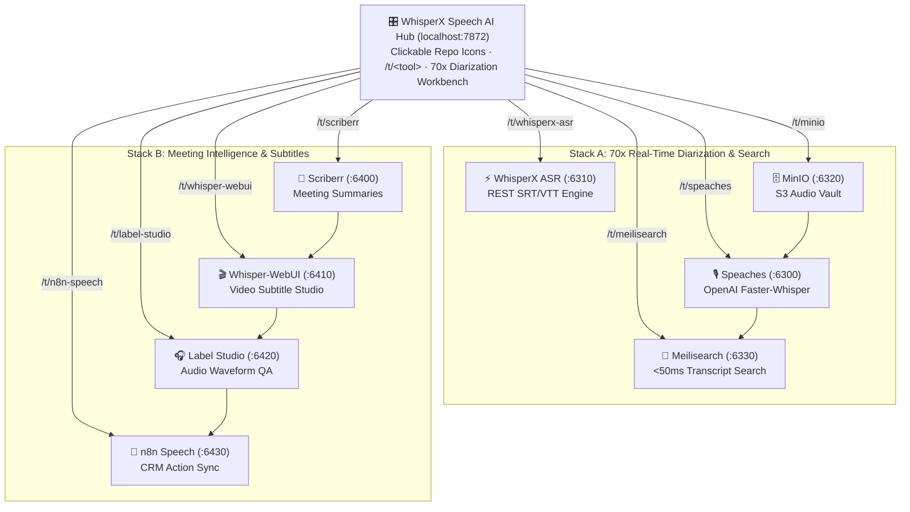

# Production System Architecture — WhisperX Speech AI

**Service ID:** `TS101-SRV-09`  
**Control Plane Hub:** `http://localhost:7872` (`hub/app.py`)

```mermaid
flowchart TD
    Hub["🎛️ WhisperX Speech AI Hub (localhost:7872)<br/>Clickable Repo Icons · /t/&lt;tool&gt; · 70x Diarization Workbench"]

    subgraph StackA["Stack A: 70x Real-Time Diarization & Search"]
        Speach["🎙️ Speaches (:6300)<br/>OpenAI Faster-Whisper"]
        WX["⚡ WhisperX ASR (:6310)<br/>REST SRT/VTT Engine"]
        MinIO["🗄️ MinIO (:6320)<br/>S3 Audio Vault"]
        Meili["🔎 Meilisearch (:6330)<br/>&lt;50ms Transcript Search"]
    end

    subgraph StackB["Stack B: Meeting Intelligence & Subtitles"]
        Scrib["📝 Scriberr (:6400)<br/>Meeting Summaries"]
        WUI["🎬 Whisper-WebUI (:6410)<br/>Video Subtitle Studio"]
        LS["🎧 Label Studio (:6420)<br/>Audio Waveform QA"]
        N8N["🔀 n8n Speech (:6430)<br/>CRM Action Sync"]
    end

    Hub -->|/t/speaches| Speach
    Hub -->|/t/whisperx-asr| WX
    Hub -->|/t/minio| MinIO
    Hub -->|/t/meilisearch| Meili
    Hub -->|/t/scriberr| Scrib
    Hub -->|/t/whisper-webui| WUI
    Hub -->|/t/label-studio| LS
    Hub -->|/t/n8n-speech| N8N

    MinIO --> Speach --> Meili
    Scrib --> WUI --> LS --> N8N
```
